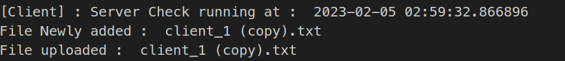
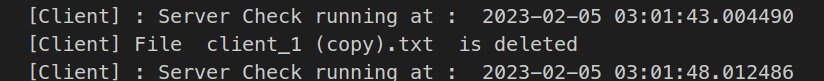
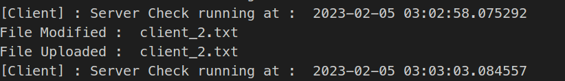

# File Transfer client using RPC


**[Introduction](#introduction)**

**[RPC](#rpc)**

**[MultiThreaded Application](#multithreaded-application)**

**[XMLRPC](#xmlrpc)**

**[Implementation - Server side](#implementation---server-side)**

> [Upload File](#upload-file)
>
> [Download File](#download-file)
>
> [Rename File](#rename-file)
>
> [Delete File](#delete-file)

**[Implementation Client side](#implementation-client-side)**

> [Connection syntax](#connection-syntax)
>
> [Upload File](#upload-file-1)
>
> [Download File](#download-file-1)
>
> [Delete file](#delete-file-1)
>
> [Rename File](#rename-file-1)
>
> [Sort Array](#sort-array)

**[Syncing Folders](#syncing-folders) 8**

> [New File Addition](#new-file-addition)
>
> [File Deletion](#file-deletion)
>
> [File Modification](#file-modification)

**[Conclusion](#conclusion)**

**[References](#references)**


# RPC

RPC in Python stands for Remote Procedure Call. It's a protocol for
making a request from one computer to another computer in a network, in
order to execute a function or procedure on the remote machine. The
caller (client) sends a request message to the server, asking it to
execute a certain function or procedure, and the server sends back a
response message, with the result of the function. In Python, the xmlrpc
library provides an implementation of the XML-RPC protocol, which is a
lightweight and simple protocol for making RPC calls over HTTP.

# MultiThreaded Application

Python has a feature called multithreading that enables many threads to
execute concurrently within a single process. A thread is a small
execution unit that can work alongside other threads simultaneously.
Multiple tasks can be carried out concurrently because threads can
communicate with one another and share the same memory space.

The threading module in Python supports multithreading. You may write a
function that will serve as the thread's target and send it along with
any parameters the function needs to the Thread function Object() to
start a new thread. The start() function may then be used to launch the
thread.While multithreading has the potential to dramatically increase
your program's speed, it also carries the danger of synchronization
issues including race situations and deadlocks. Use locks, semaphores,
and other synchronization primitives offered by the threading module to
prevent these issues.

```python
class ServerThread(threading.Thread):

    def __init__(self):

        threading.Thread.__init__(self)

        self.localServer =
        xmlrpc.server.SimpleXMLRPCServer(("localhost",8000),requestHandler=RequestHandler,

        allow_none=True)

        self.localServer.register_multicall_functions()

        self.localServer.register_function(rename_file,'rename_file') #just
    return 

    def run(self):
        self.localServer.serve_forever()
        server = ServerThread()
        server.start() 

```

We have created a new class as a wrapper to accomplish the
multithreading within our problem

# XMLRPC

A straightforward, lightweight, and simple-to-implement protocol for
performing remote procedure calls over the Internet was created called
XML-RPC. It offers a mechanism for various systems to run commands on a
distant system and get the results. The data formats, protocols, and
procedures used to transmit information across systems are defined by
the XML-RPC specification. The XML-RPC module in Python offers support
for this protocol. It may be used to build a client that can invoke
methods on a distant server or a server that exposes methods for remote
invocation.

# Implementation - Server side

To set up the server we need to use the following objects in python

-   Upload file

-   Download file

-   Rename file

-   Delete file

-   Add function

-   Sort function

## Upload File

File is loaded as a binary file from client side and will be received on
server side and loaded as a new file into the server storage
```python
def upload_file(file_name, file_content):
    with open(file_name, 'wb') as f:
    f.write(file_content.data)
    return True
```

## Download File

File is loaded as a binary file from server side and will be sent to the
client side

```python   

def upload_file(file_name, file_content):

    with open(file_name, 'wb') as f:

    f.write(file_content.data)

    return True

```
## Rename File

We will use the functionality available within the os library to change
the ungoya file name on the server

```python
def rename_file(old_file_name, new_file_name):

    os.rename(old_file_name, new_file_name)

    return True
```
## Delete File

Use the remove operation available within os library to remove the
ungoya file on server

```python
def delete_file(file_name):

    file_path = Path(f"{file_name}")

    if not file_path.exists():

    print(f"[Server] : File {file_name} does not exist..!")

    os.remove(file_name)
```

# Implementation Client side

For client side implementation we need to implement the following
parameters

-   Connection to server tag

-   Upload file

-   Download file

-   Rename file

## Connection syntax

The following syntax is used to connect to server side

```python
proxy = xmlrpc.client.ServerProxy("http://localhost:8000/RPC2")
```
## Upload File

Parse the argument accordingly to the keywords using arg parser to
upload the file to the server side

```python
if(parsedArgs.upfile != "none" ):

    my_file = Path(f"{parsedArgs.upfile}")

if not my_file.is_file():

    print(f"[Client] File {parsedArgs.upfile} does not exist..!")

with open(parsedArgs.upfile, "rb") as f:

    file_content = xmlrpc.client.Binary(f.read())

proxy.upload_file(parsedArgs.upfile, file_content)
```

to upload a file use

```
python3 client2.py --upload <filename>
```

eg:

```
python3 client2.py --upload client_1.txt
```

## Download File

Use argparser keyword of "download" to extract the name of the file what
we need to download from client side and then obtain the binary file
from server side. Then save that file as new file on the client side
```python
elif(parsedArgs.downfile != "none" ):

    with open(parsedArgs.downfile, "wb") as f:

        file_content = proxy.download_file(parsedArgs.downfile )

        f.write(file_content.data)
```
to download a file from server side, we can use

```
python3 client2.py --download <filename>
```

Eg

```
python3 client2.py --download server_2s.txt
```

## Delete file 
```python
elif(parsedArgs.deleteFile != "none" ):

    proxy.delete_file(parsedArgs.deleteFile)
```
To delete a file from server side , we need to perform

```
python3 client2.py --delete <filename>
```
Eg
```
python3 client2.py --delete server_22.txt
```

## Rename File

To rename the file, we need to pass "rename" and "renameTo" syntax as
mentioned below

to Rename a file on server side, we can use

```
python3 client2.py --rename <actualFileName> --renameTo
<changeToFileName>
```

Eg
```
python3 client2.py --rename server_3.txt --renameTo server_4.txt
```

## Sort Array

To sort the array we need to pass the parameter as "sort" in argument
list which will be parsed as an list and sent to server side

```python
parser.add_argument('--add', '--list', help='delimited list input',type=lambda s: [float(item) for item in s.split(',')],default=[],action="store")

elif(len(parsedArgs.sort) > 0):

    arr = proxy.sort_array(parsedArgs.sort)

    print("[Client] Sorted Array from server is : ", arr)
```
To sort the array , pass the array as argument

```
python3 client2.py --sort 50,3,8,1,76,34
```

# Syncing Folders

TO sync the local client folder with the serverside we need to implement
and track the following

-   New file addition

-   File Deletion

-   Existing files Modification

## New File Addition

To identify the new file added compare the new file list with the old
file list and identify the files which are on the new list and not on
the old list. The logic is given below.

```python
for i,file in enumerate(newfileList):

    date =
    datetime.fromtimestamp(os.path.getmtime(file)).strftime('%Y-%m-%d
    %H:%M:%S')

    date_time_obj = datetime.strptime(date, '%Y-%m-%d %H:%M:%S')

    newDate_L.append(date_time_obj)

    if(file not in fileList):

    print("File Newly added : " , file[2:])
```

## Upload the file to Server
```python
my_file = Path(f"{file}")

with open(file, "rb") as f:

    file_content = xmlrpc.client.Binary(f.read())

    proxy.upload_file(file, file_content)

    print("File uploaded : " , file[2:])
```

Output:

{width="6.5in"
height="0.7083333333333334in"}

## File Deletion

To identify the deleted file compare the new file list with the old file
list and identify the files which are on the old list and not on the new
list. The logic is given below.

## Detect deleted files

```python
for i,file in enumerate(fileList):

    if(file not in newfileList):

        print("[Client] File " , file[2:] , " is deleted")

        proxy.delete_file(file)

        fileList.remove(file)

    del dateList[i]
```

Sample output

{width="6.5in"
height="0.6388888888888888in"}

## File Modification

This can be identified by getting all the files which have modification
time greater than the last check time

##check if existing files are modified
```python
for i,file in enumerate(fileList):

    date =
    datetime.fromtimestamp(os.path.getmtime(file)).strftime('%Y-%m-%d
    %H:%M:%S')

    date_time_obj = datetime.strptime(date, '%Y-%m-%d %H:%M:%S')

    if(date_time_obj >= lastCheckTime):

        print("File Modified : " , file[2:])

    ## Upload the file to Server

    my_file = Path(f"{file}")

    with open(file, "rb") as f:

        file_content = xmlrpc.client.Binary(f.read())

        proxy.upload_file(file, file_content)

    print("File Uploaded : " , file[2:])
```

Sample Output

{width="6.5in"
height="0.9305555555555556in"}

